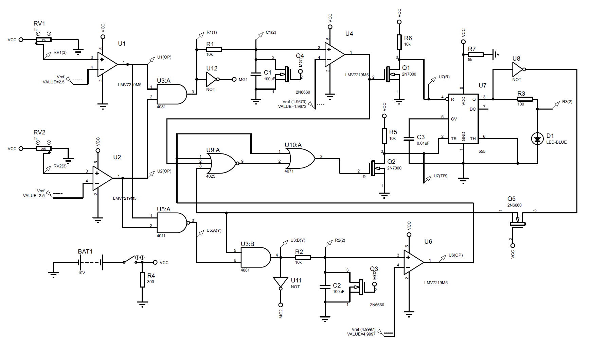

# Brake System Plausibility Device (BSPD)

A standalone, non-programmable safety circuit designed to detect simultaneous hard braking and significant motor power delivery — and open the shutdown circuit in response.

---

## What is the BSPD?

The **Brake System Plausibility Device (BSPD)** is a hardware safety system required in Formula SAE / Formula Student electric vehicles. Its purpose is to detect an implausible condition where the driver is braking hard while the motor is simultaneously being commanded to deliver significant power — and then cut power via the shutdown circuit (SDC).

---

## Rules & Requirements

### T11.6.1 — Core Function
The BSPD must open the shutdown circuit when **hard braking occurs simultaneously** with:
- **[EV ONLY]** ≥ 5 kW of power being delivered to the motors.

The shutdown circuit must remain open until:
- The LVMS (Low Voltage Master Switch) is power cycled, **OR**
- The BSPD may self-reset if the triggering condition is no longer present for more than **10 seconds**.

### T11.6.2 — Debounce Requirement
The shutdown circuit must only open if the implausibility condition is **persistent for more than 500 ms**.

### T11.6.3 — Power Supply
The BSPD must be **directly supplied from the LVMS** (see T1.3.1 and T11.3). It must not rely on any intermediate power rail or logic.

### T11.6.4 — Standalone Requirement
The BSPD is defined as **standalone** — meaning:
- No additional functionality may be implemented on the required PCBs.
- Interfaces must be reduced to the **minimum necessary signals**: power supply, required sensors, and the SDC.
- Supply and sensor signals must **not be routed through any other device** before entering the BSPD.
- If other systems share the same sensors in parallel, it must be demonstrated at Technical Inspection that they do not interfere with the BSPD.

### T11.6.5 — Brake Pressure Sensing
To detect hard braking, a **brake system pressure sensor** must be used. The threshold must be set such that:
- There are **no locked wheels**, and
- Brake pressure is **≤ 30 bar**.

---

## Schematic

---

## Notes

- This design is intended for an **Electric Vehicle (EV)** Formula Student car.
- The circuit is fully **non-programmable** and hardware-only, as required by the rules.
- All logic is implemented using discrete analog and digital components.
